![Shader Graph Demo][Shader Graph Demo]

# Blackboard 区域
## Blackboard 大体展示与说明
**Tips:** 
    属性拖拽至工作区后可以通过右键该节点定位到`Convert To Inline Node`将其转为一个常规节点, 通过类似的`Convert To Inline Node`可以将该转换的节点再次转换回属性.  

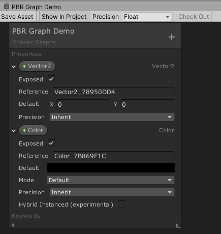

| Name | Description |
| - | - |
| Exposed | 是否将该属性暴漏在`材质的Inspection`中 |
| Reference | 在C＃脚本中显示的属性名称 |
| Mode | 有的属性有这个字段, 对于**颜色，可以选择默认或HDR**

## Precision(精度) 
精度类型如下表
| Name | Description |
| - | - |
| Float	| Sets the precision mode to float. <br> 设置精度模式为`Float` |
| Half | Sets the precision mode to half. <br> 设置精度模式为[**Half**][C# Half] |
| Inherit | Sets the precision mode to inherit. <br> 设置精度模式为`Inherit`(继承). 在下面的内容中展示了区别 |

**Tips:** [Precision中的Float和Half的区别][Precision中的Float和Half的区别]

可以看到在最上方的`菜单栏`和`Blackboard的每个属性`中都存在`Precision`属性、`内置的Node`也拥有该属性.  
后续的说明将基于如下称呼： 
* 将`菜单栏`中的`Precision`属性称作`Graph Precision`.
* 将`属性`中的`Precision`属性称作`Property Precision`.
* 将`节点`中的`Precision`属性称作`Node Precision`.

### 可视化精度
可以通过将`菜单栏/窗口`上的`Color Mode`调整为`Precision`来直观的观测每个节点使用的什么精度模式.  

- `Color Mode`默认为`<None>`, 展示效果如下
![Shader Graph Color Mode Default][Shader Graph Color Mode Default]  
- `Color Mode`调整为`Precision`, 展示效果如下
![Shader Graph Color Mode Precision][Shader Graph Color Mode Precision]
[`蓝色`表示`Float`]、[`红色`表示`Half`]

### Graph Precision
调整这个参数将影响当前Shader中的所有未被手动指定精度类型的Unity内置节点的`Precision`的类型.  
因为`Node`默认的精度类型为`Inherit`(将在`Node Precision`中说明`Inherit`的效果).  

#### 影响的内容有
- 新建的Node
- 没有指定`Precision`的Node(具体的指定方法将在`Node Precision`中说明)

#### 可选类型  
- Float
- Half

#### 对比  
[`蓝色`表示`Float`]、[`红色`表示`Half`]  
* Graph Precision为Float
![Graph Precision Float][Graph Precision Float]
* Graph Precision为Half
![Graph Precision Half][Graph Precision Half]
* 手动指定Node的精度类型(将不受`Graph Precision`控制)
![Graph Precision Custom][Graph Precision Custom]

### Node Precision(节点精度)

#### 可选类型 
- Float
- Half
- Inherit

#### 节点精度的调整方法
![Modify Node Precision][Modify Node Precision]

#### 精度转换
相连的Node精度类型如果不同时, 将发生转变, 转变规则如下: 
1. Float和Half之间直连，则会进行类型强制转换。  
2. Float和Half共同连入Inherit，因为Float比Half位数大,所以当Float和Half进行共同运算时会转为Float。  
3. Inherit直连Float或Half, 效果与Float和Half之间直连相同, 因为Inherit实际类型为Graph Procision的类型。  

- Float和Half图
![精度转变_Float和Half][精度转变_Float和Half]
- Float和Half和Inherit图
![精度转变_Float和Half和Inherited][精度转变_Float和Half和Inherit]

### Property Precision(属性精度)
将Property拖为Node后,就与`Node Precision`中所描述的含义相同.  
不过是Precision的调整将在Properties中进行, 而且也不会可视化的显示颜色区分两者.  
当然属性拖拽成为(伪)节点后可以通过右键该节点定位到`Convert To Inline Node`将其转为一个常规节点, 通过类似的`Convert To Inline Node`可以将该转换的节点再次转换回属性.  

## 常规属性Properties
| Name | Description |
| -- | -- |
| Vector 1 | A Vector 1 or scalar value |
| Vector 2 | A Vector 2 value |
| Vector 3 | A Vector 3 value |
| Vector 4 | A Vector 4 value |
| Matrix 2 | A Matrix 2x2 value |
| Matrix 3 | A Matrix 3x3 value |
| Matrix 4 | A Matrix 4x4 value |
| Boolean | A Boolean value. Defined as a float in the generated shader |
| Texture 2D | A Texture 2D asset |
| Texture 2D Array | A Texture 2D Array asset |
| Texture 3D | A Texture 3D asset |
| Cubemap | A Cubemap asset |
| Gradient | A Gradient value. Defined as a struct in the generated shader |
| SamplerState | A state used for sampling a texture |
| Color | None |

[Data-Type文档][Data-Type文档]  

这些内容将在Node Library中也有讲到

## Keyword
在添加新属性时,可以看到一个叫做Keyword的集合,其中包含了如下内容
- Boolean类型关键字
- Enum类型关键字
- Unity内置关键字

[Shader Keyword官方文档][Shader Keyword文档]

### 公共属性的含义
以下解释除了字面能理解的所有Keyword公有属性外的一些需要注意的内容  

#### Definition

#### Scope

# Node Library
[All Node In Shader Graph](https://www.youtube.com/watch?v=9aOtie1DKCc)

## Artistic(有点跟摄影/后期内容相关)
### Adjustment(校准/调整)
#### Channel Mixer(渠道混合器)
[Channel Mixer Node 文档][Channel Mixer Node 文档]  
![Channel Mixer Node Demo][Channel Mixer Node Demo]

**简单描述**  
````
控制输入的每个通道对输出的每个通道的影响.  
例如输入一个RGB颜色，通过混合器来调整其中R、G、B对结果的影响值. 可以把在保证G、B不动的情况下改变一下R的贡献.
````

#### Contrast(对比度)
[Contrast Node 文档][Contrast Node 文档]  
![Contrast Node Demo][Contrast Node Demo]

**简单描述**  
````
当Contrast为1时, 颜色呈现为白色，当Contrast逐渐下降时，颜色不断偏向黑色;
当Contrast为0时，颜色为白色到黑色的中间值，也就是说数值越大对比度越强。  

这里提到的白色和黑色并不是常规理解的白色和黑色，而是代指亮色和暗色，是一种数字的颜色化表现。
在很多3D软件中是相同的含义，一些地方黑色也表示不显示代表数值0; 白色表示显示代表数字1。
````
    
#### Hue(色相)
[Hue Node 文档][Hue Node 文档]  
![Hue Node Demo][Hue Node Demo]

**简单描述**  
````
色相就是色彩的名字。如红、橙、黄、绿、青、蓝、紫等.
Offset可以理解为，以当前颜色在表盘上的位置为0, 当Offset不断增大时, 色标沿着正方向旋转; 反之沿着负方向旋转。
以demo为例, 当Offset数值变大时，颜色变化过程为黄->绿->青->蓝->紫->红。
````

#### Invert Colors(反转颜色)
[Invert Colors Node 文档][Invert Colors Node 文档]  
![Invert Colors Node Demo][Invert Colors Node Demo]

**简单描述**  
````
在该案例中, 稍微测试一下就可以得出，不管选中R、G、B、A中的那一个，其实质都是遵循下面这个规律。
以R Channel举例, 当输入颜色的R为255时将得到输出R为0的效果，当输入R为250时将得到输出R为5的效果，本质上是以0-255取中值进行在相应的Channel上对称操作而已。
````

#### Replace Color(替换颜色)
[Replace Color Node 文档][Replace Color Node 文档]  
![Replace Color Node Demo][Replace Color Node Demo]

**简单描述**  
````
替换指定颜色为目标颜色，可通过Range加选范围，通过Fuzziness增加平滑度
````

#### Saturation(饱和度)
[Saturation Node 文档][Saturation Node 文档]  
![Saturation Node Demo][Saturation Node Demo]

**简单描述**  
````
饱和度的最佳选择范围是0到1, 0是完全去饱和，1是完全饱和
去饱和度意味着颜色将会越来越趋近灰白
超过1和1是没有区别的，但是低于0会导致向着相反的颜色前进
````

#### White Balance(白平衡)
[White Balance Node 文档][White Balance Node 文档]  
![White Balance Node Demo][White Balance Node Demo]

**简单描述**  
````
应用场景举例: 
如果拍摄的照片由于光线等问题导致颜色偏黄，可以通过白平衡来将偏黄的照片还原为现实中的白色。
````

### Blend
#### Blend(混合)
[Blend Node 文档][Blend Node 文档]

内容太多直接看文档, 和Ps里面的图层功能有点类似

### Filter
#### Dither(抖动)
[Dither Node文档][Dither Node文档]

**简单描述**  
````
一种有意的噪点形式，用于处理类似色带出现的情况，即色阶跨度明显。
在这种情况下可以使用此方法来进行过渡，减弱色阶的直接跨度感， 增加过渡感。
````

### Mask
#### Channel Mask(渠道遮罩)
[Channel Mask Node 文档][Channel Mask Node 文档]  
![Channel Mask Node Demo][Channel Mask Node Demo]

**简单描述**  
```
可以选择能被显示的Channels，没有被选中的渠道将不会被输出。
```

#### Color Mask(颜色遮罩)
[Color Mask Node 文档][Color Mask Node 文档]  
![Color Mask Node Demo][Color Mask Node Demo]

和Replace Color一样让人无法理解， 可能需要Texture来配合测试

### Normal
#### Normal Blend(法线混合)
[Normal Blend Node 文档][Normal Blend Node 文档]  
[Blending in Detail 参考文档][Blending in Detail 参考文档]  
![Normal Blend Node Demo][Normal Blend Node Demo]

提供了`Default`和`Reoriented`两种混合模式

**简单描述**  
```
混合2个法线为一个法线贴图
```

#### Normal From Height(从Height中创建Normal)
[Normal From Height Node 文档][Normal From Height Node 文档]  
![Normal From Height Node Demo][Normal From Height Node Demo]

**简单描述**  
```
通过输入的高度值创建法线贴图
```

#### Normal From Texture(从Texture中创建Normal)
[Normal From Texture Node 文档][Normal From Texture Node 文档]    
![Normal From Texture Node Demo][Normal From Texture Node Demo]

**简单描述**  
```
将Texture转换为法线贴图
```

#### Normal Reconstruct Z(法线重构Z属性)
[Normal Reconstruct Z Node 文档][Normal Reconstruct Z Node 文档]    

#### Normal Strength(法线强度)
[Normal Strength Node 文档][Normal Strength Node 文档]  
![Normal Strength Node Demo][Normal Strength Node Demo]

**简单描述**  
```
可以调整法线的强度
```

#### Normal Unpack(法线解压缩)
[Normal Unpack Node 文档][Normal Unpack Node 文档]    

### Utillty
#### Colorspace Conversion(色彩空间转换器)
[Colorspace Conversion Node 文档][Colorspace Conversion Node 文档]  
![Colorspace Conversion Node Demo][Colorspace Conversion Node Demo]

**简单描述**  
```
对色彩进行RGB、HSV、Linear之间的空间转换， 具体的我不会自己搜下
```

## Channel
### Combine(合并)
[Combine-Node 文档][Combine-Node 文档]  
![Combine-Node Demo][Combine-Node Demo]

**简单说明:**
```
基于R、G、B、A提供多种Out参数组合, 可以结合Split使用
```

### Split(分割)
[Split-Node 文档][Split-Node 文档]  
![Split-Node Demo][Split-Node Demo]

**简单说明:**
```
将Vector4分割为4个单独的属性使用
```
### Filp(翻转)
[Filp-Node 文档][Filp-Node 文档]  
![Filp-Node Demo][Filp-Node Demo]

### Swizzle(搅和)
[Swizzle-Node 文档][Swizzle-Node 文档]  
![Swizzle-Node Demo][Swizzle-Node Demo]

**简单说明:**
```
可以理解为一个物流中转站?, 在这个中转站内, 可以选择不同的输出通道使用哪个输入通道
```

## Input (输入)
### Basic (基础)
#### Boolean & Color & Constant & Integer & Slider & Time & Vector 1 ~ 4
[Boolean 文档][Boolean 文档]
[Color 文档][Color 文档]  
[Constant 文档][Constant 文档]  
[Integer 文档][Integer 文档]  
[Slider 文档][Slider 文档]  
[Time 文档][Time 文档]  
[Vector 1 文档][Vector 1 文档]  
[Vector 2 文档][Vector 2 文档]  
[Vector 3 文档][Vector 3 文档]  
[Vector 4 文档][Vector 4 文档]  
![Input Basic Demo][Input Basic Demo]

### Geometry (几何)
#### TBN Matrix [Tangent Vector & Bitangent Vector & Normal Vector]
[Tangent Vector 文档][Tangent Vector 文档]  
[Bitangent Vector 文档][Bitangent Vector 文档]  
[Normal Vector 文档][Normal Vector 文档]  
![TBN Matrix Demo][TBN Matrix Demo]

如果不知道什么是TBN Matrix，自行Google搜索

#### Position (顶点/片段位置)
[Position 文档][Position 文档]  
![Position Demo][Position Demo]

**简单说明:**
```
提供对网格顶点或片段位置的访问

Space选项提供要输出的位置的坐标空间。
Object: 物体本地位置(局部位置)
View: 我现在还不是很理解，会了再回来写
World: 返回所选脚本化渲染管道的默认世界空间
Tangent: 我现在还不是很理解，会了再回来写
Absolute World: 对于所有可编写脚本的渲染管线, 始终返回场景中对象的绝对世界位置

对于World选项来说
HDRP使用相机相对作为其默认的世界空间
URP使用Absolute World作为其默认的世界空间。
```

#### Screen Position (屏幕位置属性访问)
[Screen Position 文档][Screen Position 文档]  
![Screen Position Demo][Screen Position Demo]

**简单说明:**
```
我不会用, 会用了再解释

提供对网格顶点或片段的"屏幕位置"的访问 

Default
返回屏幕位置。此模式将屏幕位置除以剪辑空间位置W分量。
Raw
返回屏幕位置。此模式不会将“ 屏幕位置”除以剪辑空间位置W分量。这对于投影很有用。
Center
返回屏幕位置偏移量，以便位置float2(0,0)位于屏幕的中心。
Tiled
返回屏幕位置偏移量，以便位置float2(0,0)位于屏幕的中心并使用进行平铺frac。
```

#### UV
[UV 文档][UV 文档]  
![UV Demo][UV Demo]
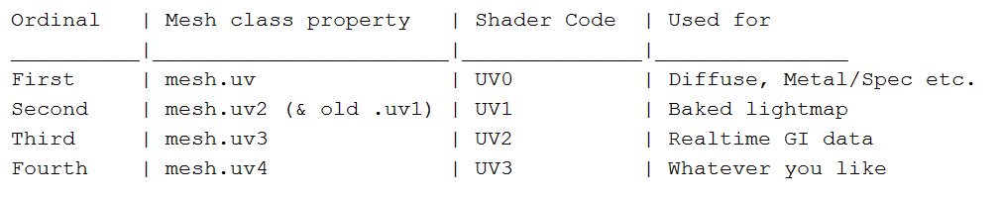

**简单说明:**
```
提供对网格顶点或片段的UV坐标的访问

可通过Channel参数选择输出值的坐标通道
```

#### Vertex Color (顶点颜色)
[Vertex Color 文档][Vertex Color 文档]  
![Vertex Color Demo][Vertex Color Demo]

**简单说明:**
```
提供对网格顶点或片段的"顶点颜色"值的访问
```

##### View Direction (试图方向)
[View Direction 文档][View Direction 文档]  
![View Direction Demo][View Direction Demo]

### Gradient(渐变)
#### Gradient & Sample Gradient(渐变)
[Gradient 文档][Gradient 文档]  
[Sample Gradient 文档][Sample Gradient 文档]  
![Gradient And Sample Gradient Node Demo][Gradient And Sample Gradient Node Demo]

### Matrix (矩阵)
需要基础的线性代数知识

#### Matrix 2x2、3x3、4x4 & Transformation Matrix(变换矩阵)
[Matrix 2x2 文档][Matrix 2x2 文档]  
[Matrix 3x3 文档][Matrix 3x3 文档]  
[Matrix 4x4 文档][Matrix 4x4 文档]  
[Transformation Matrix 文档][Transformation Matrix 文档]  
![Matrix Demo][Matrix Demo]

没什么好说的, 就是基础的矩阵类型而已,

### PBR
#### Dielectric Specular
[Dielectric Specular 文档][Dielectric Specular 文档]  
![Dielectric Specular Demo][Dielectric Specular Demo]

**简单说明:**
```
直接看官网，我没用过不知道, 应该时返回各种可选材料的高光值
```

#### Metal Reflectance (金属反射率)
[Metal Reflectance 文档][Metal Reflectance 文档]  
![Metal Reflectance Demo][Metal Reflectance Demo]

**简单说明:**
```
返回基于物理的材料的"金属反射率"值
```

### Scene (针对场景的一些节点)
#### Camera (相机属性访问)
[Camera 文档][Camera 文档]  
![Camera Demo][Camera Demo]

**简单说明:**
```
提供对当前用于渲染的摄影机的各种参数的访问。它由Camera的GameObject 的值（例如Position和Direction）以及各种投影参数组成。

只支持Universal RP，不支持HDRP
```

#### Fog (雾属性访问)
[Fog 文档][Fog 文档]  
![Fog Demo][Fog Demo]

**简单说明:**
```
提供对场景的“ 雾”参数的访问

只支持Universal RP，不支持HDRP
```

#### Object (渲染的Object的数据访问)
[Object 文档][Object 文档]  
![Object Demo][Object Demo]

**简单说明:**
```
提供对当前渲染的Object的各种参数的访问。

支持Universal RP和HDRP

与Position节点不同，Position是针对顶点和片段的
```

#### Scene Color
[Scene Color 文档][Scene Color 文档]  
![Scene Color Demo][Scene Color Demo]

#### Scene Depth
[Scene Depth 文档][Scene Depth 文档]  
![Scene Depth Demo][Scene Depth Demo]

#### Screen
[Screen 文档][Screen 文档]  
![Screen Demo][Screen Demo]

**简单说明:**
```
提供对屏幕参数的访问。

只支持Universal RP，不支持HDRP
```

### Texture
#### Cubemap Asset & Sample Cubemap (Cubemap资产)
[Cubemap Asset 文档][Cubemap Asset 文档]  
[Sample Cubemap 文档][Sample Cubemap 文档]  
![Sample Cubemap & Sample Cubemap Demo][Sample Cubemap & Sample Cubemap Demo]

**简单说明:**
```
Cubemap Asset 必须和 Sample Cubemap 成对出现使用，但 Sample Cubemap 可以单独使用

入参属性Sampler是可以用Sampler State连接的，且只能用它连接。

这个我也没用过，不会
```

##### Cubemap制作流程
[Cubemap 制作须知1](https://youtu.be/jxsp9DQH_F0)
[Cubemap 制作须知2](https://www.bilibili.com/video/BV1iJ411T7Xc)

看完这两个视频，差不多就能做出来Cubemap，反正我不想试。

#### Texture 2D Asset & Sample Texture 2D (2D材质)
[Sample Texture 2D 文档][Sample Texture 2D 文档]  
[Texture 2D Asset 文档][Texture 2D Asset 文档]  
![Texture 2D Asset & Sample Texture 2D Demo][Texture 2D Asset & Sample Texture 2D Demo]

**简单说明:**
```
前者必须和后者成对出现使用，但后者可以单独使用

Sample Texture 2D:
入参属性Sampler是可以用Sampler State连接的，且只能用它连接。
入参属性UV并不是直连UV节点的，而是连接经过其他UV节点处理过后的UV (UV的处理节点 按空格 -> 定位到UV)。

返回值很明了是RGBA数据。

可选参数Type是用来指定当前2D材质图片是普通图片还是法线贴图的。
可选参数Space官网没找到说明。
```

#### Texture 2D Array Asset & Sample Texture 2D Array (2D Array 材质)
[Sample Texture 2D Array 文档][Sample Texture 2D Array 文档]  
[Texture 2D Array Asset 文档][Texture 2D Array Asset 文档]  
![Texture 2D Array Asset & Sample Texture 2D Array Demo][Texture 2D Array Asset & Sample Texture 2D Array Demo]

**简单说明:**
```
前者必须和后者成对出现使用，但后者可以单独使用

Sample Texture 2D:
入参属性Sampler是可以用Sampler State连接的，且只能用它连接。
入参属性UV并不是直连UV节点的，而是连接经过其他UV节点处理过后的UV (UV的处理节点 按空格 -> 定位到UV)。
入参属性Index是让你从Texture Array中选择用的

返回值很明了是RGBA数据。
```

#### Sample Texture 2D LOD (2D LOD 材质)
[Sample Texture 2D LOD 文档][Sample Texture 2D LOD 文档]  
![Sample Texture 2D LOD Demo][Sample Texture 2D LOD Demo]

**简单说明:**
```
跟Sample Texture 2D内容一样

只是多出来一个入参LOD属性
该属性在Type为Normal时将生效, 用于调整法线贴图的细节程度。
```

#### Texture 3D Asset & Sample Texture 3D (3D材质)
[Sample Texture 3D 文档][Sample Texture 3D 文档]  
[Texture 3D Asset 文档][Texture 3D Asset 文档]  
![Texture 3D Asset & Sample Texture 3D Demo][Texture 3D Asset & Sample Texture 3D Demo]

**简单说明:**
```
前者必须和后者成对出现使用，但后者可以单独使用

Sample Texture 3D:
入参属性Sampler是可以用Sampler State连接的，且只能用它连接。
入参属性UV并不是直连UV节点的，而是连接经过其他UV节点处理过后的UV (UV的处理节点 按空格 -> 定位到UV)。

返回值很是Vector 4数据，实际上就是RGBA。
```

#### Sampler State (采样器)
[Sampler State 文档][Sampler State 文档]  
![Sampler State Demo][Sampler State Demo]

这里展示以下Wrap的不同效果，至于Filter的效果自己试一试理解

* Repeat 重复  
如上图所示
* Clamp 钳制  
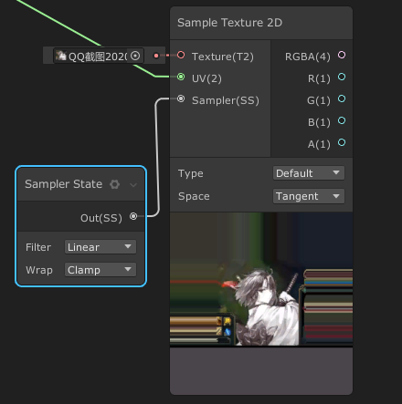
* Mirror 镜像  
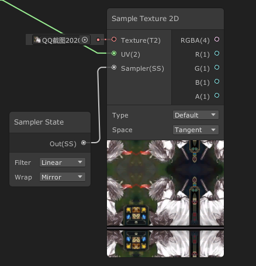
* Mirror Once 镜像一次  
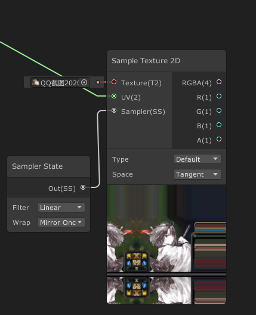

#### Texel Size (获取图片分辨率)
[Texel Size 文档][Texel Size 文档]  
![Texel Size Demo][Texel Size Demo]

**简单说明:**
```
获取到图片的分辨率
```


## Master
[PBR Master](https://docs.unity3d.com/Packages/com.unity.shadergraph@7.3/manual/PBR-Master-Node.html)  
[Unlit Master](https://docs.unity3d.com/Packages/com.unity.shadergraph@7.3/manual/Unlit-Master-Node.html)  
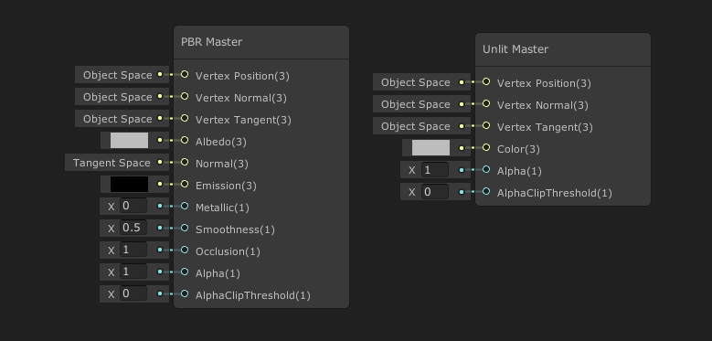  

在使用其他渲染管线之后, Master节点不止有这两个, 直接看文档吧


## Math (数学)
### Advanced
#### Absolute (绝对值)
[Absolute 文档][Absolute 文档]  
![Absolute Demo][Absolute Demo]

**简单说明**
```
f(In) = |In| = Out

输入值In的类型为Dynamic Vector

举例: 输入为-2 
f(-2) = |-2| = 2
```

#### Exponential (指数运算)
[Exponential 文档][Exponential 文档]  
![Exponential Demo][Exponential Demo]

**简单说明**
```
f(In) = Base ^ In = Out

输入值In的类型为Dynamic Vector
Base属性调整的是底数(提供2和e两个可选内容)，传入的In是作为指数(power)存在的
Base E : Returns e to the power of input In (返回e与指数In的值)
Base 2 : Returns 2 to the power of input In (返回2与指数In的值)

举例: 输入为0
f(0) = e^0 = 1
或
f(0) = 2^0 = 1
```

#### Length (向量长度)
[Length 文档][Length 文档]  
![Length Demo][Length Demo]

**简单说明**
```
输入值In的类型为Dynamic Vector

举例: 输入值为一个Vector2类型的数据
Vector2会在二维坐标定义一个坐标点, Length Node会通过勾股定理(也叫毕达哥拉斯定理)求出从原点到该坐标的长度。

更高维的向量计算的方法看官网。
```

#### Log (对数运算)
[Log 文档][Log 文档]  
![Log Demo][Log Demo]

**简单说明**
```
f(In) = LogBase(In) = Out

输入值In的类型为Dynamic Vector
Base属性调整的是底数(提供2、e和10三个可选内容), 传入的In是作为真数存在的

举例: 输入为10
f(10) = log2(10)   Base = 2
或
f(10) = lg(10)   Base = 10
或
f(10) = ln(10)   Base = e 
```

#### Modulo (模运算)
[Modulo 文档][Modulo 文档]  
![Modulo Demo][Modulo Demo]

**简单说明**
```
f(A, B) = A % B = Out

输入值A和B的类型为Dynamic Vector

模运算, 常规语言的数学库中提供Mod()方法, 我常常将模运算与始终挂钩.

举例: 输入为10
f(10, 15) = 10 % 15
```

#### Negate (取反)
[Negate 文档][Negate 文档]  
![Negate Demo][Negate Demo]

**简单说明**
```
f(In) = -1 * IN = Out

输入值In的类型为Dynamic Vector

举例: 输入为10
f(10) = -1 * 10 = -10
```

#### Normalize (标准化/归一化)
[Normalize 文档][Normalize 文档]  
![Normalize Demo][Normalize Demo]

**简单说明**
```
输入值In的类型为Dynamic Vector

将传入的Vector规范化，使结果与目标方向保持相同，但长度为1
```

#### Posterize (色调分离/量化)
[Posterize 文档][Posterize 文档]  
![Posterize Demo][Posterize Demo]

**简单说明**
```
输入值In和Steps的类型为Dynamic Vector

方法的目的是: 将色调的连续渐变转换为较少色调的多个区域.

在上图的示例中
当Steps的绝对值越小时, 条带化越严重(颜色的变化会更明显、过渡效果会更少); 相反则进行增加。
但最好的情况实际上和传入时差不多, 这是一种故意让色调条带化的方法，就如同颗粒一样的存在。
```

#### Reciprocal (倒数运算)
[Reciprocal 文档][Reciprocal 文档]  
![Reciprocal Demo][Reciprocal Demo]

**简单说明**
```
f(In) = 1 / In = Out

输入值In的类型为Dynamic Vector

Method提供了Default和Fast两个参数, Default则是采用上面的函数逻辑, Fast则是一种快速近似算法

举例: 输入为10
f(10) = 1 / 10 = 1/10
```

#### Reciprocal Square Root (平方根倒数运算)
[Reciprocal Square Root 文档][Reciprocal Square Root 文档]  
![Reciprocal Square Root Demo][Reciprocal Square Root Demo]

**简单说明**
```
f(In) = 1 / In的平方根 = Out

输入值In的类型为Dynamic Vector

举例: 输入为100
f(100) = 1 / 100的平方根 = 1 / 10 = 1/10
```

### Basic
#### Add & Subtract & Multiply & Divide (加减乘除)
![加减乘除 Demo][加减乘除 Demo]

```
提示: 上文中有提到颜色与数字也可以挂钩  0为黑色 1为白色  
在这些基础上颜色也可以运算 Out数值越大越倾向于白色，越小越倾向于黑色
```

#### Square Root (平方根)
[Square Root 文档][Square Root 文档]  
![Square Root Demo][Square Root Demo]

**简单说明**
```
f(In) = In的平方根运算 = Out

输入值In的类型为Dynamic Vector

举例: 输入为100
f(100) = 10
```

#### Power (幂运算/指数运算)
[Power 文档][Power 文档]  
![Power Demo][Power Demo]

**简单说明**
```
f(In) = A ^ B = Out

输入值A和B的类型为Dynamic Vector

举例: 输入为2, 3
f(2, 3) = 2 ^ 3 = 8
```

### Derivative (导数/偏导数)
该内容和微积分、微分几何相关，需要相应的数学基础  
[An introduction to shader derivative functions][An introduction to shader derivative functions]

#### DDX
[DDX 文档][DDX 文档]  
![DDX Demo][DDX Demo]

**简单说明**
```
In = f(X, Y)
Out = ∂In / ∂x

输入值In的类型为Dynamic Vector

返回输入In相对于屏幕空间x坐标的偏导数.
形象化: 二元函数f在特定x点的斜率

以上图为例, 向右为x正方向, 向上为y正方向. (黑为0, 白为1)
在x方向上
白色向黑色过渡:
实际则为1->0的变化，如果绘制为函数则白->黑的过程是一个下降的过程，斜率是负数，所以此过程在DDX中显示为黑色
黑色向白色过渡:
实际则为0->1的变化，如果绘制为函数则黑->白的过程是一个上升的过程，斜率>0，所以此过程在DDX中的显示为白色
```
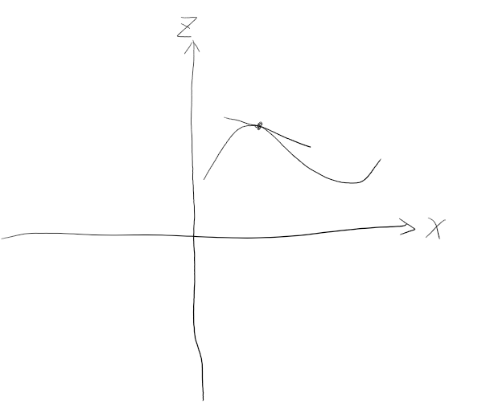

#### DDY
[DDY 文档][DDY 文档]  
![DDY Demo][DDY Demo]

**简单说明**
```
In = f(X, Y)
Out = ∂In / ∂y

输入值In的类型为Dynamic Vector

返回输入In相对于屏幕空间y坐标的偏导数
形象化: 二元函数f在特定y点的斜率

以上图为例, 向右为x正方向, 向上为y正方向. (黑为0, 白为1)
在y方向上
白色向黑色过渡:
实际则为1->0的变化，如果绘制为函数则白->黑的过程是一个下降的过程，斜率是负数，所以此过程在DDX中显示为黑色
黑色向白色过渡:
实际则为0->1的变化，如果绘制为函数则黑->白的过程是一个上升的过程，斜率>0，所以此过程在DDX中的显示为白色
```
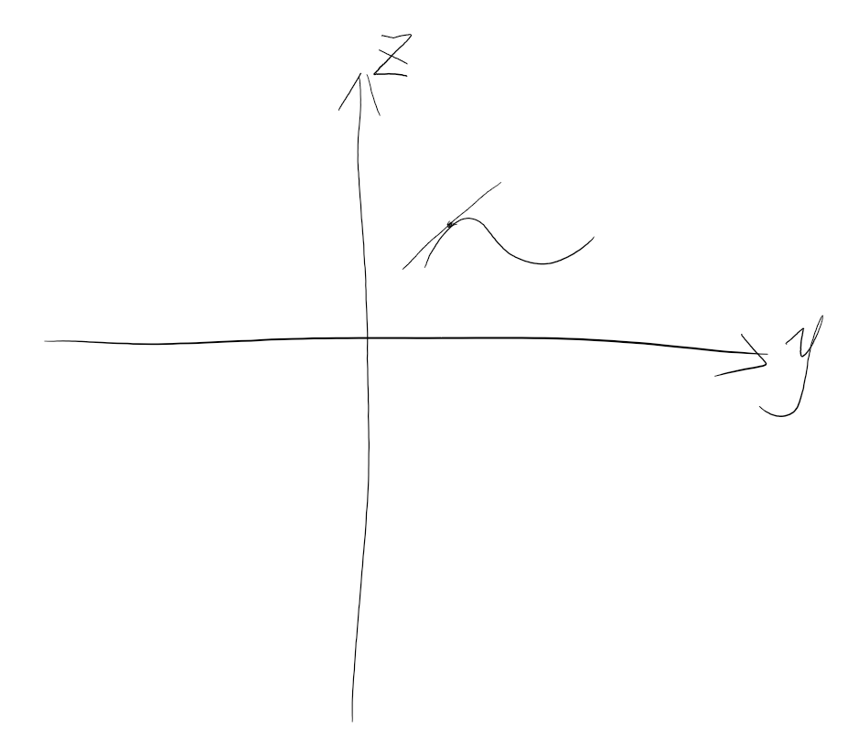

#### DDXY
[DDXY 文档][DDXY 文档]  
![DDXY Demo][DDXY Demo]

**简单说明**
```
输入值In的类型为Dynamic Vector

计算核心: DDX(In) + DDY(In)
```

### Interpolation (插补函数)
#### Lerp (线性插值)
[Lerp 文档][Lerp 文档]  
![Lerp Demo][Lerp Demo]

**简单说明**
```
输入值A和B的类型为Dynamic Vector, T应该是一个0-1的数值
当T为0时，Out为A; 当T为1时, Out为B
当T为0~1之间时, 则Out为插值计算结果，可复现上图自己观察下
```

#### Inverse Lerp (Lerp的逆运算)
[Inverse Lerp 文档][Inverse Lerp 文档]  
![Inverse Lerp Demo][Inverse Lerp Demo]

**简单说明**
```
输入值A和B的类型为Dynamic Vector, T最好符合该规则: B<= T >= A, 当超出A和B规定的范围后最终将得到0或者1

举例说明:
var lerp = Lerp(1, 10, 0.5f);
Debug.Log(lerp);  // 5.5
Debug.Log(InverseLerp(1, 10, lerp));  // 0.5
```

#### Smoothstep (平滑过渡)
[Smoothstep 文档][Smoothstep 文档]  
![Smoothstep Demo][Smoothstep Demo]

**简单说明**
```
该函数的主要目的与Lerp相同，不过Lerp是线性的，而Smoothstep则是淡入淡出的曲线

void Update() {
    Mathf.SmoothStep(10, 20, Time.time);
}
```

### Matrix (矩阵)
这部分需要一点线性代数的基础知识

#### Matrix Construction (矩阵组建)
[Matrix Construction 文档][Matrix Construction 文档]  
![Matrix Construction Demo][Matrix Construction Demo]

**简单解释**
```
通过多组Vector 4作为入参来构造矩阵

其中提供了Row和Column选项，可以选择每个传入的Vector是作为还是列存在
```

#### Matrix Determinant (行列式)
[Matrix Determinant 文档][Matrix Determinant 文档]  
![Matrix Determinant Demo][Matrix Determinant Demo]

**简单解释**
```
输入值In的类型为Dynamic Matrix

矩阵的行列式是一个数字，这个数字包含了矩阵的大量信息。
矩阵的行列式如果为零，代表矩阵不可逆，矩阵是奇异的。

矩阵A的行列式写作det A或|A|
单元矩阵的行列式为1
矩阵的转置的行列式＝矩阵本身的行列式
```

#### Matrix Split (矩阵分割)
[Matrix Split 文档][Matrix Split 文档]  
![Matrix Split Demo][Matrix Split Demo]

**简单解释**
```
输入值In的类型为Dynamic Matrix

将矩阵重新分割为特定维度的向量组
```

#### Matrix Transpose (矩阵转置)
[Matrix Transpose 文档][Matrix Transpose 文档]  
![Matrix Transpose Demo][Matrix Transpose Demo]

**简单解释**
```
输入值In的类型为Dynamic Matrix

矩阵A的转置记作AT(T位于A的右上角，跟次方写法一样)
转置矩阵形象化表达就是将矩阵的左下角换到矩阵的右上角
```

### Range (范围)
#### Clamp (钳制数据范围)
[Clamp 文档][Clamp 文档]  
![Clamp Demo][Clamp Demo]

**简单说明:**
```
输入值In的类型为Dynamic Vector

当In超出Min和Max的规定范围后将被Min或Max相应的取代。
```

#### Fraction (获取参数的小数部分)
[Fraction 文档][Fraction 文档]  
![Fraction Demo][Fraction Demo]

**简单说明:**
```
输入值In的类型为Dynamic Vector

获取到输入参数的小数部分，为什么叫做Fraction可能是这么个逻辑
只要带分数的分数部分，带分数的分数部分就是小数部分....
```

#### Maximum (获取两个传入值中最大的)
[Maximum 文档][Maximum 文档]  
![Maximum Demo][Maximum Demo]

**简单说明:**
```
输入值In的类型为Dynamic Vector

返回A和B中最大的值
```

#### Minimum (获取两个传入值中最小的)
[Minimum 文档][Minimum 文档]  
![Minimum Demo][Minimum Demo]

**简单说明:**
```
输入值In的类型为Dynamic Vector

返回A和B中最小的值
```

#### One Minus (1 - 传入值)
[One Minus 文档][One Minus 文档]  
![One Minus Demo][One Minus Demo]

**简单说明:**
```
输入值In的类型为Dynamic Vector

1-In、(1, 1) - In、etc....
```

#### Random Range (指定范围内进行随机)
[Random Range 文档][Random Range 文档]  
![Random Range Demo][Random Range Demo]

**简单说明:**
```
带有随机种子的随机方法

随机种子一般情况下用一维就够，这里提供二维的随机种子是为了方便基于UV输入生成随机数
```

#### Remap (重映射)
[Remap 文档][Remap 文档]  
![Remap Demo][Remap Demo]

**简单说明:**
```
将输入In在In Min Max中所处的位置变换为比例，将该比例重新映射到Out Min Max规定的范围内后输出

举例: 输入值In为0.5
根据0.5将In Min Max进行线性插值(-1, -.5, 0, .5, 1)，0.5位于4/5的地方
将Out Min Max按照In Min Max插值的数量进行线性插值(0, .25, .5, .75, 1)
所以最终输出为.75
```

#### Saturate (饱和)
[Saturate 文档][Saturate 文档]  
![Saturate Demo][Saturate Demo]

**简单说明:**
```
返回限制在0和1之间的输入In的值.
等同于Clamp里面min=0、max=1的情况
```

### Round (围绕/舍入)
#### Ceiling (天花板)
[Ceiling 文档][Ceiling 文档]  
![Ceiling Demo][Ceiling Demo]  

**简单说明:**
```
返回大于或等于输入值In的整数

f(.1) = 1
```

#### Floor (地板)
[Floor 文档][Floor 文档]  
![Floor Demo][Floor Demo]  

**简单说明:**
```
返回小于或等于输入值In的整数

f(.9) = 0
```

#### Round (四舍五入)
[Round 文档][Round 文档]  
![Round Demo][Round Demo]  

**简单说明:**
```
四舍五入到最接近的整数
从.5为分割线，小数位小于等于.5的都向下取整，大于.5的都向上取整
```

#### Sign (标记 <0 = -1; 0 = 0; >0 = 1)
[Sign 文档][Sign 文档]  
![Sign Demo][Sign Demo]  

**简单说明:**
```
对于每个组件，如果输入In的值小于零，则返回-1；如果等于零，则返回0；如果大于零，则返回1。
```

#### Step (In>=Edge = 1; In<Edge = 0)
[Step 文档][Step 文档]  
![Step Demo][Step Demo]  

**简单说明:**
```
对于每个组件，如果输入In的值大于或等于输入Edge的值，则返回1，否则返回0。
```

#### Truncate (获取整数部分)
[Truncate 文档][Truncate 文档]  
![Truncate Demo][Truncate Demo]  

**简单说明:**
```
获取传入值的整数部分

例如: 传入值In为0.5
f(.5) = 0
```

### Trigonometry (三角学)
#### Cosine (余弦函数)
[Cosine 文档][Cosine 文档]  
![Cosine Demo][Cosine Demo]

**简单说明:**
```
PI等于3.1415...是以弧度的形式出现的

上图展示的逻辑是PI -> 将PI转为角度 -> 计算目标角度 -> 角度转为弧度 -> Cos求值
在后续的Sin和Tan的图中将不采用这种较复杂的流

根据上面的说明可以看出  Sin、Cos、Tan这些函数传入的参数是弧度


下面是测试代码
在Java种实现的测试代码, C#中一样

// 角度
double degrees = 27;
// 弧度
double radians = Math.toRadians(degrees);

System.out.format("%.1f 度的正弦值为 %.4f%n", degrees, Math.sin(radians));  0.4540
System.out.format("%.1f 度的余弦值为 %.4f%n", degrees, Math.cos(radians));  0.8910
System.out.format("%.1f 度的正切值为 %.4f%n", degrees, Math.tan(radians));  0.5095
```

#### Sine (正弦函数)
[Sine 文档][Sine 文档]  
![Sine Demo][Sine Demo]

**简单说明:**
```
看Cosine的说明
```

#### Tangent (正切函数)
[Tangent 文档][Tangent 文档]  
![Tangent Demo][Tangent Demo]

**简单说明:**
```
看Cosine的说明
```

#### Arccosine (反余弦)
[Arccosine 文档][Arccosine 文档]  
![Arccosine Demo][Arccosine Demo]

**简单说明:**
```
上图展示的逻辑是 将27度转为弧度 -> Cos求值 -> 反Cos求值 -> 通过Round配合Step验证得到的结果是不是27

在后续的Asin和Atan的图中将不采用这种较复杂的流

根据上面的说明可以看出反余弦就是余弦算法的逆向运算, 在反正弦和反正切中同理
```

#### Arcsine (反正弦)
[Arcsine 文档][Arcsine 文档]  
![Arcsine Demo][Arcsine Demo]

**简单说明:**
```
看Arccosine的说明
```

#### Arctangent (反正切)
[Arctangent 文档][Arctangent 文档]  
![Arctangent Demo][Arctangent Demo]

**简单说明:**
```
看Arccosine的说明
```

#### Arctangent2 (反正切2)
[Arctangent2 文档][Arctangent2 文档]  
![Arctangent2 Demo][Arctangent2 Demo]

**简单说明:**
```
Arctangent2和普通的Arctangent不同

上图展示的逻辑是 atan2(1, 1) -> 将返回的弧度转为角度 -> 通过Round配合Step验证得到的结果是不是45

它接收到的两个入参确认了一个位于二维象限中的坐标，然后根据该坐标与原点求出这条连线与x轴正方向构成的夹角(0 ~ 正负180)

例如: 
atan2(1, 1) = 45
```

#### Hyperbolic Cosine (双曲余弦)
[Hyperbolic Cosine 文档][Hyperbolic Cosine 文档]  
![Hyperbolic Cosine Demo][Hyperbolic Cosine Demo]

**简单说明:**
```

```

#### Hyperbolic Sine (双曲正弦)
[Hyperbolic Sine 文档][Hyperbolic Sine 文档]  
![Hyperbolic Sine Demo][Hyperbolic Sine Demo]

**简单说明:**
```

```

#### Hyperbolic Tangent (双曲正切)
[Hyperbolic Tangent 文档][Hyperbolic Tangent 文档]  
![Hyperbolic Tangent Demo][Hyperbolic Tangent Demo]

**简单说明:**
```

```

#### Degrees To Radians (将度转为弧度)
[Degrees To Radians 文档][Degrees To Radians 文档]  

#### Radians To Degrees (将弧度转为度)
[Radians To Degrees 文档][Radians To Degrees 文档]  

### Vector (向量)
#### Cross Product (向量积/叉积)
[Cross Product 文档][Cross Product 文档]  
![Cross Product Demo][Cross Product Demo]

**简单说明:**
```
输入值A和B的类型为Vector3

返回的结果是一个垂直于两个输入值的一个Vector3类型数据(可叫做法向量)。

距离: A: (1, 0, 0)  B: (3, 4, 0)
1. 可以使用左手定则确认第三个轴的方向(第一个向量垂直于掌心，四指并拢朝向第二个向量，与食指垂直90度的拇指就是第三个向量的方向)，在这基础上你可以变动你的判断条件.
2. 通过 A*B*Sin∠AB得出第三个轴的长度
A: (1, 0, 0) = length为1
B: (3, 4, 0) = length为5
结果就等于 1 * 5 * 4/5 = 4 所以 第三个向量为(0, 0, 4)
```

#### Distance (距离)
[Distance 文档][Distance 文档]  
![Distance Demo][Distance Demo]

**简单说明:**
```
计算两个向量之间的距离
```

#### Dot Product (向量点积)
[Dot Product 文档][Dot Product 文档]  
![Dot Product Demo][Dot Product Demo]

**简单说明:**
```
伪公式: f(A, B) = A * B在A上的投影 = Out

第一个传入值作为X轴正方向, 对第二个值在X轴上做垂直投影, 第一个值乘以第二个值的投影就是点积的结果。
如果两个箭头方向相反，那么点积的结果就是负数。

上图展示了两个Vector 3的乘积并进行了结果验证，点积的结果是一个数字(标量)
```

#### Fresnel Effect (菲涅耳效应)
[Fresnel Effect 文档][Fresnel Effect 文档]  
![Fresnel Effect Demo][Fresnel Effect Demo]

**简单说明:**
```
菲尼尔反射: https://baike.baidu.com/item/%E8%8F%B2%E5%B0%BC%E5%B0%94%E5%8F%8D%E5%B0%84/6908014
更形象的例子: 如果你站在湖边，低头看脚下的水，你会发现水是透明的，反射不是特别强烈，如果你看远处的湖面，你会发现水并不透明，这说明反射非常强烈。这就是“菲涅尔效应”。

当Power越小时，菲尼尔现象范围越大；当Power越大时，菲尼尔现象范围越小。
因为核心的计算公式缩略后如此 Out = pow(一个0~1之间的数, Power)
```

#### Projection (投影)
[Projection 文档][Projection 文档]  
![Projection Demo][Projection Demo]

**简单说明:**
```
参数A垂直投影在参数B上的位置

举例: A: (x, 0, 0)  B: (5, x, 0)
经过B点做垂直于X轴的投影, 投影的位置就是(5, 0, 0)

计算公式: Out = B * dot(A, B) / dot(B, B);
```

#### Reflection (反射)
[Reflection 文档][Reflection 文档]  
![Reflection Demo][Reflection Demo]

**简单说明:**
```
沿着Normal作为对称轴对输入值In进行对称
```

#### Rejection (向量拒识)
[Rejection 文档][Rejection 文档]  
![Rejection Demo][Rejection Demo]

**简单说明:**
```
参数A投影到参数B的正交或垂直的平面上，与上面的投影有一些不同

举例:
1). 输入值A: (-5, 3, 0)  输入值B：(0, 1, 0)
输入值B是y轴, 那么与其垂直的平面就是x轴构成的平面
最终结果就是输入值A投影到x轴上的值(-5, 0, 0)

2). 输入值A: (-5, 3, 0)  输入值B：(1, 0, 0)
输入值B是x轴, 那么与其垂直的平面就是y轴构成的平面
最终结果就是输入值A投影到y轴上的值(0, 3, 0)

2). 输入值A: (-5, 3, 0)  输入值B：(1, 1, 0)
输入值B是正x轴和正y轴的45度角分割线, 那么与其垂直的平面就是负x轴和正y轴的45度角构成的平面
最终结果就是输入值A投影到y轴上的值(-4, 4, 0)
计算公式: A - (B * dot(A, B) / dot(B, B))
```

#### Rotate About Axis (绕轴旋转)
[Rotate About Axis 文档][Rotate About Axis 文档]  
![Rotate About Axis Demo][Rotate About Axis Demo]

**简单说明:**
```
该节点提供了 按角度 和 按弧度 两种旋转方式

输入值In围绕着轴Axis按照指定的旋转方式和旋转数值进行旋转
```

#### Sphere Mask (球形遮罩)
[Sphere Mask 文档][Sphere Mask 文档]  
![Sphere Mask Demo][Sphere Mask Demo]

**简单说明:**
```
Coords和Center的类型是Dynamic Vector
Radius和Hardness的类型是Vector 1

Center控制了Mask产生的位置
Radius控制了产生的球形遮罩的半径
Hardness控制了球星遮罩的硬度(如果为1将没有过渡效果，如果为0将遮罩全部, 随后进行展示)

上图中显示的白色的部位是被遮罩的部分
```
* Hardness为1  
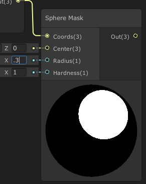
* Hardness为0  
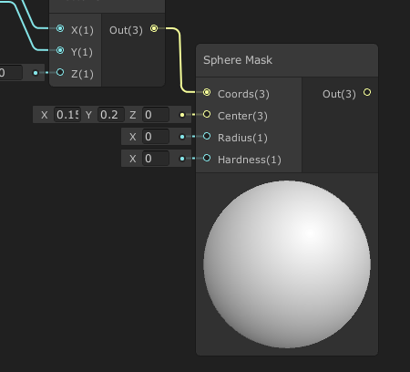

#### Transform(坐标空间的转换)
[Transform 文档][Transform 文档]  
![Transform Demo][Transform Demo]

### Wave (波)
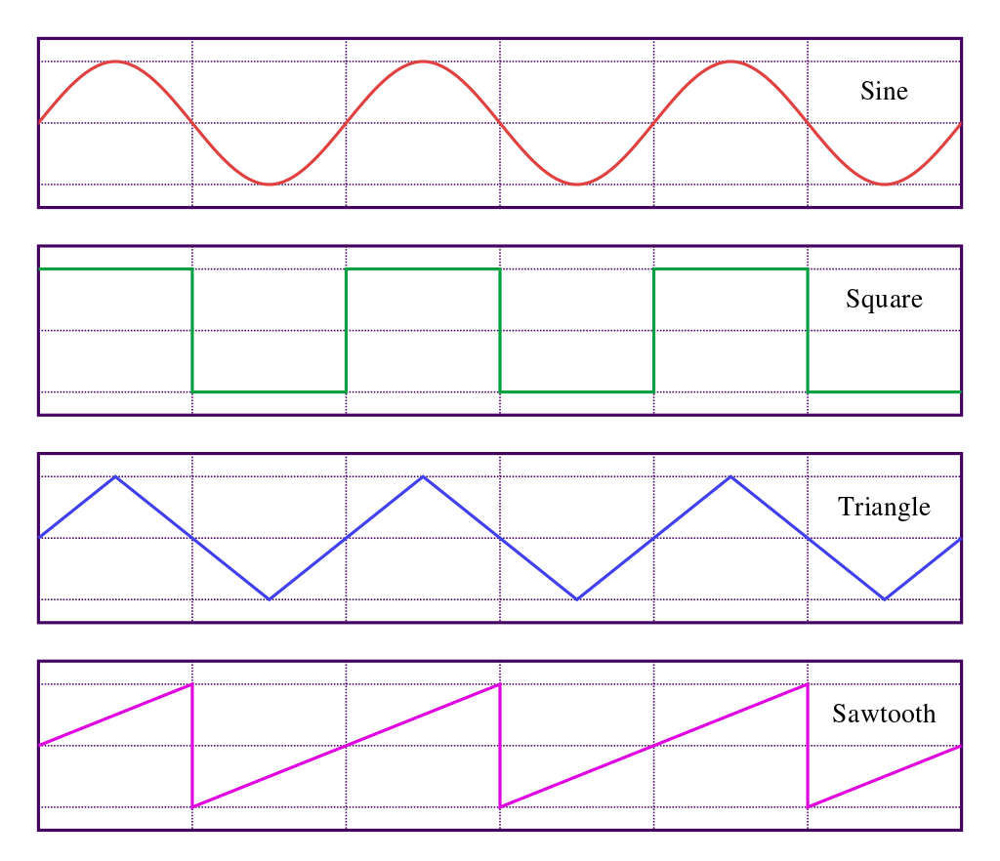

**总体说明:**
```
首先计算输入值的相应波，随后添加伪随机噪点到振幅中，噪点受min和max影响。
```

#### Noise Sine Wave (噪点正弦波)
[Noise Sine Wave 文档][Noise Sine Wave 文档]  
![Noise Sine Wave Demo][Noise Sine Wave Demo]

**简单说明:**
```
看"Wave > 总体说明"
```

#### Sawtooth Wave (锯形波)
[Sawtooth Wave 文档][Sawtooth Wave 文档]  
![Sawtooth Wave Demo][Sawtooth Wave Demo]

**简单说明:**
```
看"Wave > 总体说明"

上图不仅展示了Sawtooth Wave的效果，还展示了Sawtooth Wave的计算过程
```

#### Square Wave (方形波)
[Square Wave 文档][Square Wave 文档]  
![Square Wave Demo][Square Wave Demo]

**简单说明:**
```
看"Wave > 总体说明"

上图不仅展示了Square Wave的效果，还展示了Square Wave的计算过程
```

#### Triangle Wave (锥型波)
[Triangle Wave 文档][Triangle Wave 文档]  
![Triangle Wave Demo][Triangle Wave Demo]

**简单说明:**
```
看"Wave > 总体说明"

计算过程:
Out = 2.0 * abs( 2 * (In - floor(0.5 + In)) ) - 1.0;
```

## Procedural (程序化)
### Noise (噪点)
#### Gradient Noise (渐变噪点)
[Gradient Noise 文档][Gradient Noise 文档]  
![Gradient Noise Demo][Gradient Noise Demo]

**简单说明:**
```
可以根据UV生成渐变的或者Perlin Noise，产生的噪声的大小由输入Scale控制。

ps:
可能有地方忘了说, 凡是入参可以传入二维UV数据的Node.
使用方式并不是直连UV组件，而是指可以使用通过处理过后的UV.
```

#### Simple Noise
[Simple Noise 文档][Simple Noise 文档]  
![Simple Noise Demo][Simple Noise Demo]

**简单说明:**
```
可以根据UV生成简单的或者Value Noise，产生的噪声的大小由输入Scale控制。

ps:
可能有地方忘了说, 凡是入参可以传入二维UV数据的Node.
使用方式并不是直连UV组件，而是指可以使用通过处理过后的UV.
```

#### Voronoi (泰森多边形->效果像细胞)
[Voronoi 文档][Voronoi 文档]  
![Voronoi Demo][Voronoi Demo]

**简单说明:**
```
效果像细胞

ps:
可能有地方忘了说, 凡是入参可以传入二维UV数据的Node.
使用方式并不是直连UV组件，而是指可以使用通过处理过后的UV.
```

### Shapes (形状)
#### Ellipse (椭圆)
[Ellipse 文档][Ellipse 文档]  
![Ellipse Demo][Ellipse Demo]

#### Polygon (多边形)
[Polygon 文档][Polygon 文档]  
![Polygon Demo][Polygon Demo]

#### Rectangle (矩形)
[Rectangle 文档][Rectangle 文档]  
![Rectangle Demo][Rectangle Demo]

#### Rounded Rectangle (圆角矩形)
[Rounded Rectangle 文档][Rounded Rectangle 文档]  
![Rounded Rectangle Demo][Rounded Rectangle Demo]

### Checkerboard (棋盘格)
[Checkerboard 文档][Checkerboard 文档]  
![Checkerboard Demo][Checkerboard Demo]

**简单说明:**
```
可能有地方忘了说, 凡是入参可以传入二维UV数据的Node.
使用方式并不是直连UV组件，而是指可以使用通过处理过后的UV.
```

## Utility (多用途)
### Logic (逻辑运算方法)
#### And(和运算) & Nand(与非运算) & Not(非运算) & Or(或运算)
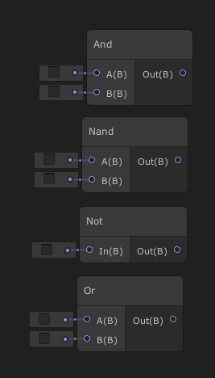

**简单说明:**
```
And: Out = A && B

Nand: Out = !A && !B

Not: Out = !In

Not: Out = A || B

可连接至Branch节点将Bool类型结果转换为常规值(0或1)
```
这4个逻辑运算方法节点的Input Port和Out Port只能连接其他的逻辑运算方法

#### All & Any & Comparison & Is Na​N & Is Infinite
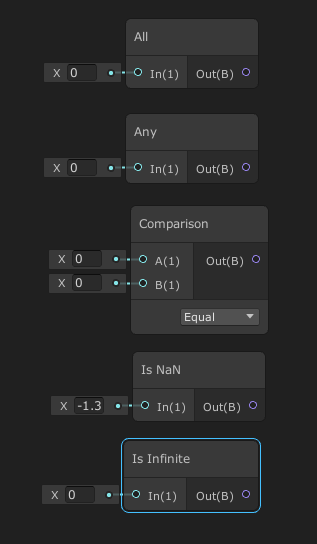

**简单说明:**
```
All: 如果输入的所有分量都不是0，则输出true。 [入参类型: Dynamic Vector]
类似: (A&&B)

Any: 如果输入的任何分量中有一个不为0，则输出true。 [入参类型: Dynamic Vector]
类似: (!(A||B))

Comparison: 提供了针对两个数据的多个判断逻辑。[入参类型: Vector 1]

Is Na​N: 如果输入的In不是数字(NaN)，则返回true。[入参类型: Vector 1]

Is Infinite: 如果输入In是一个无限值，则返回true。

可连接至Branch节点将Bool类型结果转换为常规值(0或1)
```
这4个逻辑运算方法节点的Out Port只能连接其他的逻辑运算方法

#### Is Front Face
[Is Front Face 文档][Is Front Face 文档]  
![Is Front Face Demo][Is Front Face Demo]

**简单说明:**
```
一般情况下，着色器只会渲染面向摄像机的一面，常规情况下该功能没用。
当想要使用该Node时，需要勾选Master的Two Sided属性

可连接至Branch节点将Bool类型结果转换为常规值(0或1)
```

#### Branch
[Branch 文档][Branch 文档]  
![Branch Demo][Branch Demo]

**简单说明:**
```
所有的逻辑运算方法的结果，都必须经由该节点转换为其他节点能接收的数值才能与其他类型节点一起使用。
```

### Preview (预览图)
[Preview 文档][Preview 文档]  
![Preview Demo][Preview Demo]

**简单说明:**
```
例如上图这样，渲染管线没有挂载正常，但又想看看渲染结果的话，就可以使用这个组件来预览。
```

### Custom Function (自定义方法)
[Custom Function 文档][Custom Function 文档]  

## UV
### Flipbook (类似那种本上的快速翻页动画)
[Flipbook 文档][Flipbook 文档]  
![Flipbook Demo][Flipbook Demo]

**简单说明:**
```
相当于将一个Flipbook解析为一个数组，通过Width和Height来确认Flipbook的大小, 通过Tile来获取相应位置的数据
```

### Polar Coordinates (极坐标系)
[Polar Coordinates 文档][Polar Coordinates 文档]  
![Polar Coordinates Demo][Polar Coordinates Demo]

**简单说明:**
```
想象一张纸，纸上面是一张完整的画，现在在x轴的平面上弯曲拉伸它直到原先纸的左边碰到纸的右边
```

### Radial Shear (径向剪切 - 鱼眼镜头效果)
[Radial Shear 文档][Radial Shear 文档]  
![Radial Shear Demo][Radial Shear Demo]

**简单说明:**
```
鱼眼镜头的效果
```

### Rotate (旋转)
[Rotate 文档][Rotate 文档]  
![Rotate Demo][Rotate Demo]

**简单说明:**
```
基于给定的Center对目标进行按照特定的方式的旋转，旋转多少靠Rotation进行调整

Unit里提供角度和弧度两个选项
```

### Spherize (球形化)
[Spherize 文档][Spherize 文档]  
![Spherize Demo][Spherize Demo]

**简单说明:**
```
想象一下把Texture贴到一个球体上再看
```

### Tiling And Offset (平铺和偏移)
[Tiling And Offset 文档][Tiling And Offset 文档]  
![Tiling And Offset Demo][Tiling And Offset Demo]

**简单说明:**
```
太简单了，不做说明
```

### Tri planar (三向贴图)
[Triplanar 文档][Triplanar 文档]  
![Triplanar Demo][Triplanar Demo]

**简单说明:**
```
如果看了官网的链接还不知道什么是三向贴图可以看下面的链接
[三向贴图--解决地形拉伸贴图变形以及贴图边缘的缝隙问题](https://blog.csdn.net/liu_if_else/article/details/73833656)
[Tri-Planar 三平面投影图-V-Ray for SketchUp](https://www.bilibili.com/video/BV1oW411i7TG)
```

### Twirl (旋转扭曲/涡形旋转/漩涡)
[Twirl 文档][Twirl 文档]  
![Twirl Demo][Twirl Demo]

**简单说明:**
```
官方说类似于黑洞的旋转扭曲效果

效果像是捏住中间然后强行旋转周围(从上向下看的龙卷风)
```


# Markdown链接整理
<!--精度相关的链接-->
[C# Half]: https://en.wikipedia.org/wiki/Half-precision_floating-point_format
[Shader Graph Demo]: images/Shader_Graph_Demo.png "Shader Graph总览"
[Shader Graph Color Mode Default]: images/Shader_Graph_Color_Mode_Default.png "将Color Mode调整为<None>"
[Shader Graph Color Mode Precision]: images/Shader_Graph_Color_Mode_Precision.png "将Color Mode调整为Precision"
[Graph Precision Float]: images/Graph_Precision_Float.png "Graph Precision为Float"
[Graph Precision Half]: images/Graph_Precision_Half.png "Graph Precision为Half"
[Graph Precision Custom]: images/Graph_Precision_Custom.png "指定Graph Precision后手动修改节点的Precision"
[Modify Node Precision]: images/Modify_Node_Precision.png "修改Node Precision的类型"
[精度转变_Float和Half]: images/精度转变_Float和Half.png "当相连Node的精度为Float或Half"
[精度转变_Float和Half和Inherit]: images/精度转变_Float和Half和Inherit.png "当相连Node的精度为Float或Half或Inherited"
[Precision中的Float和Half的区别]: https://docs.unity3d.com/Packages/com.unity.shadergraph@9.0/manual/Precision-Types.html "Precision中的Float和Half的区别"
<!--精度相关的链接结束-->
[Shader Keyword文档]: https://docs.unity3d.com/Packages/com.unity.shadergraph@9.0/manual/Keywords.html "Shader Keyword文档"
[Data-Type文档]: https://docs.unity3d.com/Packages/com.unity.shadergraph@9.0/manual/Data-Types.html "Data-Type文档"
<!-- Node Library -->
[Channel Mixer Node Demo]: images/Channel_Mixer.png 
[Channel Mixer Node 文档]: https://docs.unity3d.com/Packages/com.unity.shadergraph@9.0/manual/Channel-Mixer-Node.html
[Contrast Node Demo]: images/Contrast.png
[Contrast Node 文档]: https://docs.unity3d.com/Packages/com.unity.shadergraph@9.0/manual/Contrast-Node.html
[Hue Node Demo]: images/Hue.png
[Hue Node 文档]:https://docs.unity3d.com/Packages/com.unity.shadergraph@9.0/manual/Hue-Node.html
[Invert Colors Node Demo]: images/Invert_Colors.png
[Invert Colors Node 文档]:https://docs.unity3d.com/Packages/com.unity.shadergraph@9.0/manual/Invert-Colors-Node.html
[Replace Color Node Demo]: images/Replace_Color.png
[Replace Color Node 文档]: https://docs.unity3d.com/Packages/com.unity.shadergraph@9.0/manual/Replace-Color-Node.html
[Saturation Node Demo]: images/Saturation.png
[Saturation Node 文档]: https://docs.unity3d.com/Packages/com.unity.shadergraph@9.0/manual/Saturation-Node.html
[White Balance Node Demo]: images/White_Balance.png
[White Balance Node 文档]: https://docs.unity3d.com/Packages/com.unity.shadergraph@9.0/manual/White-Balance-Node.html
[Blend Node 文档]: https://docs.unity3d.com/Packages/com.unity.shadergraph@9.0/manual/Blend-Node.html
[Dither Node文档]: https://docs.unity3d.com/Packages/com.unity.shadergraph@9.0/manual/Dither-Node.html
[Channel Mask Node Demo]: images/Channel_Mask.png
[Channel Mask Node 文档]: https://docs.unity3d.com/Packages/com.unity.shadergraph@9.0/manual/Channel-Mask-Node.html
[Color Mask Node Demo]: images/Color_Mask.png
[Color Mask Node 文档]: https://docs.unity3d.com/Packages/com.unity.shadergraph@9.0/manual/Color-Mask-Node.html

[Normal Blend Node Demo]: images/Normal_Blend.png
[Normal Blend Node 文档]: https://docs.unity3d.com/Packages/com.unity.shadergraph@9.0/manual/Normal-Blend-Node.html
[reoriented normal blend注解]: https://zhuanlan.zhihu.com/p/68375439
[Blending in Detail 参考文档]: https://blog.selfshadow.com/publications/blending-in-detail/
[Normal From Height Node Demo]: images/Normal_From_Height.png
[Normal From Height Node 文档]: https://docs.unity3d.com/Packages/com.unity.shadergraph@9.0/manual/Normal-From-Height-Node.html
[Normal From Texture Node Demo]: images/Normal_From_Texture.png
[Normal From Texture Node 文档]: https://docs.unity3d.com/Packages/com.unity.shadergraph@9.0/manual/Normal-From-Texture-Node.html
[Normal Reconstruct Z Node 文档]: https://docs.unity3d.com/Packages/com.unity.shadergraph@9.0/manual/Normal-Reconstruct-Z-Node.html
[Normal Strength Node Demo]: images/Normal_Strength.png
[Normal Strength Node 文档]: https://docs.unity3d.com/Packages/com.unity.shadergraph@9.0/manual/Normal-Strength-Node.html
[Normal Unpack Node 文档]: https://docs.unity3d.com/Packages/com.unity.shadergraph@9.0/manual/Normal-Unpack-Node.html
[Colorspace Conversion Node Demo]: images/Colorspace_Conversion.png
[Colorspace Conversion Node 文档]:https://docs.unity3d.com/Packages/com.unity.shadergraph@9.0/manual/Colorspace-Conversion-Node.html

[Combine-Node Demo]: images/Combine.png
[Combine-Node 文档]: https://docs.unity3d.com/Packages/com.unity.shadergraph@9.0/manual/Combine-Node.html
[Split-Node Demo]: images/Split.png
[Split-Node 文档]: https://docs.unity3d.com/Packages/com.unity.shadergraph@9.0/manual/Split-Node.html
[Flip-Node Demo]: images/Flip.png
[Filp-Node 文档]: https://docs.unity3d.com/Packages/com.unity.shadergraph@7.3/manual/Flip-Node.html
[Swizzle-Node Demo]: images/Swizzle.png
[Swizzle-Node 文档]: https://docs.unity3d.com/Packages/com.unity.shadergraph@7.3/manual/Swizzle-Node.html

[Input Basic Demo]: images/Input_Basic.png
[TBN Matrix Demo]: images/TBN_Matrix.png
[Tangent Vector 文档]: https://docs.unity3d.com/Packages/com.unity.shadergraph@7.3/manual/Tangent-Vector-Node.html
[Bitangent Vector 文档]: https://docs.unity3d.com/Packages/com.unity.shadergraph@7.3/manual/Bitangent-Vector-Node.html
[Normal Vector 文档]: https://docs.unity3d.com/Packages/com.unity.shadergraph@7.3/manual/Normal-Vector-Node.html

[Gradient And Sample Gradient Node Demo]: images/Gradient_Demo.png
[Gradient 文档]: https://docs.unity3d.com/Packages/com.unity.shadergraph@7.3/manual/Gradient-Node.html
[Sample Gradient 文档]: https://docs.unity3d.com/Packages/com.unity.shadergraph@7.3/manual/Sample-Gradient-Node.html

[Matrix Demo]: images/Matrix.png


[Absolute 文档]: https://docs.unity3d.com/Packages/com.unity.shadergraph@7.3/manual/Absolute-Node.html
[Absolute Demo]: images/Absolute.png
[Exponential 文档]: https://docs.unity3d.com/Packages/com.unity.shadergraph@7.3/manual/Exponential-Node.html
[Exponential Demo]: images/Exponential.png
[Length 文档]: https://docs.unity3d.com/Packages/com.unity.shadergraph@7.3/manual/Length-Node.html
[Length Demo]: images/Length.png
[Log 文档]: https://docs.unity3d.com/Packages/com.unity.shadergraph@7.3/manual/Log-Node.html
[Log Demo]: images/Log.png
[Modulo 文档]: https://docs.unity3d.com/Packages/com.unity.shadergraph@7.3/manual/Modulo-Node.html
[Modulo Demo]: images/Modulo.png
[Negate 文档]: https://docs.unity3d.com/Packages/com.unity.shadergraph@7.3/manual/Negate-Node.html
[Negate Demo]: images/Negate.png
[Normalize 文档]: https://docs.unity3d.com/Packages/com.unity.shadergraph@7.3/manual/Normalize-Node.html
[Normalize Demo]: images/Normalize.png
[Posterize 文档]: https://docs.unity3d.com/Packages/com.unity.shadergraph@7.3/manual/Posterize-Node.html
[Posterize Demo]: images/Posterize.png
[Reciprocal 文档]: https://docs.unity3d.com/Packages/com.unity.shadergraph@7.3/manual/Reciprocal-Node.html
[Reciprocal Demo]: images/Reciprocal.png
[Reciprocal Square Root 文档]: https://docs.unity3d.com/Packages/com.unity.shadergraph@7.3/manual/Reciprocal-Square-Root-Node.html
[Reciprocal Square Root Demo]: images/Reciprocal_Square_Root.png
[加减乘除 Demo]: images/Add&Subtract&Multiply&Divide.png
[Square Root 文档]: https://docs.unity3d.com/Packages/com.unity.shadergraph@7.3/manual/Square-Root-Node.html
[Square Root Demo]: images/Square_Root.png
[Power 文档]: https://docs.unity3d.com/Packages/com.unity.shadergraph@7.3/manual/Power-Node.html
[Power Demo]: images/Power.png
[An introduction to shader derivative functions]: http://www.aclockworkberry.com/shader-derivative-functions/#footnote_3_1104
[DDX 文档]: https://docs.unity3d.com/Packages/com.unity.shadergraph@7.2/manual/DDX-Node.html
[DDX Demo]: images/DDX.png
[DDY 文档]: https://docs.unity3d.com/Packages/com.unity.shadergraph@7.2/manual/DDY-Node.html
[DDY Demo]: images/DDY.png
[DDXY 文档]: https://docs.unity3d.com/Packages/com.unity.shadergraph@7.2/manual/DDXY-Node.html
[DDXY Demo]: images/DDXY.png
[Inverse Lerp 文档]: https://docs.unity3d.com/Packages/com.unity.shadergraph@7.2/manual/Inverse-Lerp-Node.html
[Inverse Lerp Demo]: images/Inverse_Lerp.png
[Lerp 文档]: https://docs.unity3d.com/Packages/com.unity.shadergraph@7.2/manual/Lerp-Node.html
[Lerp Demo]: images/Lerp.png
[Smoothstep 文档]: https://docs.unity3d.com/Packages/com.unity.shadergraph@7.2/manual/Smoothstep-Node.html
[Smoothstep Demo]: images/Smoothstep.png
[Matrix Construction 文档]: https://docs.unity3d.com/Packages/com.unity.shadergraph@7.2/manual/Matrix-Construction-Node.html
[Matrix Construction Demo]: images/Matrix_Construction.png
[Matrix Determinant 文档]: https://docs.unity3d.com/Packages/com.unity.shadergraph@7.2/manual/Matrix-Determinant-Node.html
[Matrix Determinant Demo]: images/Matrix_Determinant.png
[Matrix Split 文档]: https://docs.unity3d.com/Packages/com.unity.shadergraph@7.2/manual/Matrix-Split-Node.html
[Matrix Split Demo]: images/Matrix_Split.png
[Matrix Transpose 文档]: https://docs.unity3d.com/Packages/com.unity.shadergraph@7.2/manual/Matrix-Transpose-Node.html
[Matrix Transpose Demo]: images/Matrix_Transpose.png
[Clamp 文档]: https://docs.unity3d.com/Packages/com.unity.shadergraph@7.2/manual/Clamp-Node.html
[Clamp Demo]: images/Clamp.png
[Fraction 文档]: https://docs.unity3d.com/Packages/com.unity.shadergraph@7.2/manual/Fraction-Node.html
[Fraction Demo]: images/Fraction.png
[Maximum 文档]: https://docs.unity3d.com/Packages/com.unity.shadergraph@7.2/manual/Maximum-Node.html
[Maximum Demo]: images/Maximum.png
[Minimum 文档]: https://docs.unity3d.com/Packages/com.unity.shadergraph@7.2/manual/Minimum-Node.html
[Minimum Demo]: images/Minimum.png
[One Minus 文档]: https://docs.unity3d.com/Packages/com.unity.shadergraph@7.2/manual/One_Minus-Node.html
[One Minus Demo]: images/One_Minus.png
[Random Range 文档]: https://docs.unity3d.com/Packages/com.unity.shadergraph@7.2/manual/Random-Range-Node.html
[Random Range Demo]: images/Random_Range.png
[Remap 文档]: https://docs.unity3d.com/Packages/com.unity.shadergraph@7.2/manual/Remap-Node.html
[Remap Demo]: images/Remap.png
[Saturate 文档]: https://docs.unity3d.com/Packages/com.unity.shadergraph@7.2/manual/Saturate-Node.html
[Saturate Demo]: images/Saturate.png
[Ceiling 文档]: https://docs.unity3d.com/Packages/com.unity.shadergraph@7.3/manual/Ceiling-Node.html
[Ceiling Demo]: images/Ceiling.png
[Floor 文档]: https://docs.unity3d.com/Packages/com.unity.shadergraph@7.3/manual/Floor-Node.html
[Floor Demo]: images/Floor.png
[Round 文档]: https://docs.unity3d.com/Packages/com.unity.shadergraph@7.3/manual/Round-Node.html
[Round Demo]: images/Round.png
[Sign 文档]: https://docs.unity3d.com/Packages/com.unity.shadergraph@7.3/manual/Sign-Node.html
[Sign Demo]: images/Sign.png
[Step 文档]: https://docs.unity3d.com/Packages/com.unity.shadergraph@7.3/manual/Step-Node.html
[Step Demo]: images/Step.png
[Truncate 文档]: https://docs.unity3d.com/Packages/com.unity.shadergraph@7.3/manual/Truncate-Node.html
[Truncate Demo]: images/Truncate.png
[Cosine 文档]: https://docs.unity3d.com/Packages/com.unity.shadergraph@7.3/manual/Cosine-Node.html
[Cosine Demo]: images/Cosine.png
[Sine 文档]: https://docs.unity3d.com/Packages/com.unity.shadergraph@7.3/manual/Sine-Node.html
[Sine Demo]: images/Sine.png
[Tangent 文档]: https://docs.unity3d.com/Packages/com.unity.shadergraph@7.3/manual/Tangent-Node.html
[Tangent Demo]: images/Tangent.png
[Arccosine 文档]: https://docs.unity3d.com/Packages/com.unity.shadergraph@7.3/manual/Arccosine-Node.html
[Arccosine Demo]: images/Arccosine.png
[Arcsine 文档]: https://docs.unity3d.com/Packages/com.unity.shadergraph@7.3/manual/Arcsine-Node.html
[Arcsine Demo]: images/Arcsine.png
[Arctangent 文档]: https://docs.unity3d.com/Packages/com.unity.shadergraph@7.3/manual/Arctangent-Node.html
[Arctangent Demo]: images/Arctangent.png
[Arctangent2 文档]: https://docs.unity3d.com/Packages/com.unity.shadergraph@7.3/manual/Arctangent2-Node.html
[Arctangent2 Demo]: images/Arctangent2.png
[Hyperbolic Cosine 文档]: https://docs.unity3d.com/Packages/com.unity.shadergraph@7.3/manual/Hyperbolic-Cosine-Node.html
[Hyperbolic Cosine Demo]: images/Hyperbolic_Cosine.png
[Hyperbolic Sine 文档]: https://docs.unity3d.com/Packages/com.unity.shadergraph@7.3/manual/Hyperbolic-Sine-Node.html
[Hyperbolic Sine Demo]: images/Hyperbolic_Sine.png
[Hyperbolic Tangent 文档]: https://docs.unity3d.com/Packages/com.unity.shadergraph@7.3/manual/Hyperbolic-Tangent-Node.html
[Hyperbolic Tangent Demo]: images/Hyperbolic_Tangent.png
[Degrees To Radians 文档]: https://docs.unity3d.com/Packages/com.unity.shadergraph@7.3/manual/Degrees-To-Radians-Node.html
[Radians To Degrees 文档]: https://docs.unity3d.com/Packages/com.unity.shadergraph@7.3/manual/Radians-To-Degrees-Node.html
[Cross Product 文档]: https://docs.unity3d.com/Packages/com.unity.shadergraph@7.3/manual/Cross-Product-Node.html
[Cross Product Demo]: images/Cross_Product.png
[Distance 文档]: https://docs.unity3d.com/Packages/com.unity.shadergraph@7.3/manual/Distance-Node.html
[Distance Demo]: images/Distance.png
[Dot Product 文档]: https://docs.unity3d.com/Packages/com.unity.shadergraph@7.3/manual/Dot-Product-Node.html
[Dot Product Demo]: images/Dot_Product.png
[Fresnel Effect 文档]: https://docs.unity3d.com/Packages/com.unity.shadergraph@7.3/manual/Fresnel-Effect-Node.html
[Fresnel Effect Demo]: images/Fresnel_Effect.png
[Projection 文档]: https://docs.unity3d.com/Packages/com.unity.shadergraph@7.3/manual/Projection-Node.html
[Projection Demo]: images/Projection.png
[Reflection 文档]: https://docs.unity3d.com/Packages/com.unity.shadergraph@7.3/manual/Reflection-Node.html
[Reflection Demo]: images/Reflection.png
[Rejection 文档]: https://docs.unity3d.com/Packages/com.unity.shadergraph@7.3/manual/Rejection-Node.html
[Rejection Demo]: images/Rejection.png
[Rotate About Axis 文档]: https://docs.unity3d.com/Packages/com.unity.shadergraph@7.3/manual/Rotate-About-Axis-Node.html
[Rotate About Axis Demo]: images/Rotate_About_Axis.png
[Sphere Mask 文档]: https://docs.unity3d.com/Packages/com.unity.shadergraph@7.3/manual/Sphere-Mask-Node.html
[Sphere Mask Demo]: images/Sphere_Mask.png
[Transform 文档]: https://docs.unity3d.com/Packages/com.unity.shadergraph@7.3/manual/Transform-Node.html
[Transform Demo]: images/Transform.png
[Noise Sine Wave 文档]: https://docs.unity3d.com/Packages/com.unity.shadergraph@7.3/manual/Noise-Sine-Wave-Node.html
[Noise Sine Wave Demo]: images/Noise_Sine_Wave.png
[Sawtooth Wave 文档]: https://docs.unity3d.com/Packages/com.unity.shadergraph@7.3/manual/Sawtooth-Wave-Node.html
[Sawtooth Wave Demo]: images/Sawtooth_Wave.png
[Square Wave 文档]: https://docs.unity3d.com/Packages/com.unity.shadergraph@7.3/manual/Square-Wave-Node.html
[Square Wave Demo]: images/Square_Wave.png
[Triangle Wave 文档]: https://docs.unity3d.com/Packages/com.unity.shadergraph@7.3/manual/Triangle-Wave-Node.html
[Triangle Wave Demo]: images/Triangle_Wave.png
[Gradient Noise 文档]: https://docs.unity3d.com/Packages/com.unity.shadergraph@7.3/manual/Gradient-Noise-Node.html
[Gradient Noise Demo]: images/Gradient_Noise.png
[Simple Noise 文档]: https://docs.unity3d.com/Packages/com.unity.shadergraph@7.3/manual/Simple-Noise-Node.html
[Simple Noise Demo]: images/Simple_Noise.png
[Voronoi 文档]: https://docs.unity3d.com/Packages/com.unity.shadergraph@7.3/manual/Voronoi-Node.html
[Voronoi Demo]: images/Voronoi.png
[Ellipse 文档]: https://docs.unity3d.com/Packages/com.unity.shadergraph@7.3/manual/Ellipse-Node.html
[Ellipse Demo]: images/Ellipse.png
[Polygon 文档]: https://docs.unity3d.com/Packages/com.unity.shadergraph@7.3/manual/Polygon-Node.html
[Polygon Demo]: images/Polygon.png
[Rectangle 文档]: https://docs.unity3d.com/Packages/com.unity.shadergraph@7.3/manual/Rectangle-Node.html
[Rectangle Demo]: images/Rectangle.png
[Rounded Rectangle 文档]: https://docs.unity3d.com/Packages/com.unity.shadergraph@7.3/manual/Rounded-Rectangle-Node.html
[Rounded Rectangle Demo]: images/Rounded_Rectangle.png
[Checkerboard 文档]: https://docs.unity3d.com/Packages/com.unity.shadergraph@7.3/manual/Checkerboard-Node.html
[Checkerboard Demo]: images/Checkerboard.png
[Is Front Face 文档]: https://docs.unity3d.com/Packages/com.unity.shadergraph@7.3/manual/Is-Front-Face-Node.html
[Is Front Face Demo]: images/Is_Front_Face.png
[Branch 文档]: https://docs.unity3d.com/Packages/com.unity.shadergraph@7.3/manual/Branch-Node.html
[Branch Demo]: images/Branch.png
[Preview 文档]: https://docs.unity3d.com/Packages/com.unity.shadergraph@7.3/manual/Preview-Node.html
[Preview Demo]: images/Preview.png
[Custom Function 文档]: https://docs.unity3d.com/Packages/com.unity.shadergraph@7.3/manual/Custom-Function-Node.html
[Custom Function Demo]: images/Custom_Function.png
[Cubemap Asset 文档]: https://docs.unity3d.com/Packages/com.unity.shadergraph@7.3/manual/Cubemap-Asset-Node.html
[Sample Cubemap 文档]: https://docs.unity3d.com/Packages/com.unity.shadergraph@7.3/manual/Sample-Cubemap-Node.html
[Sample Cubemap & Sample Cubemap Demo]: images/Cubemap_Asset&Sample_Cubemap.png
[Texture 2D Asset 文档]: https://docs.unity3d.com/Packages/com.unity.shadergraph@7.3/manual/Texture-2D-Asset-Node.html
[Sample Texture 2D 文档]: https://docs.unity3d.com/Packages/com.unity.shadergraph@7.3/manual/Sample-Texture-2D-Node.html
[Texture 2D Asset & Sample Texture 2D Demo]: images/Texture_2D_Asset&Sample_Texture_2D.png
[Sample Texture 2D Array 文档]: https://docs.unity3d.com/Packages/com.unity.shadergraph@7.3/manual/Sample-Texture-2D-Array-Node.html
[Texture 2D Array Asset 文档]: https://docs.unity3d.com/Packages/com.unity.shadergraph@7.3/manual/Texture-2D-Array-Asset-Node.html
[Texture 2D Array Asset & Sample Texture 2D Array Demo]: images/Texture_2D_Array_Asset&Sample_Texture_2D_Array.png
[Texture 3D Asset 文档]: https://docs.unity3d.com/Packages/com.unity.shadergraph@7.3/manual/Texture-3D-Asset-Node.html
[Sample Texture 3D 文档]: https://docs.unity3d.com/Packages/com.unity.shadergraph@7.3/manual/Sample-Texture-3D-Node.html
[Texture 3D Asset & Sample Texture 3D Demo]: images/Texture_3D_Asset&Sample_Texture_3D.png
[Sample Texture 2D LOD 文档]: https://docs.unity3d.com/Packages/com.unity.shadergraph@7.3/manual/Sample-Texture-2D-LOD-Node.html
[Sample Texture 2D LOD Demo]: images/Sample_Texture_2D_LOD.png
[Sampler State 文档]: https://docs.unity3d.com/Packages/com.unity.shadergraph@7.3/manual/Sampler-State-Node.html
[Sampler State Demo]: images/Sampler_State.png
[Texel Size 文档]: https://docs.unity3d.com/Packages/com.unity.shadergraph@7.3/manual/Texel-Size-Node.html
[Texel Size Demo]: images/Texel_Size.png
[Camera 文档]: https://docs.unity3d.com/Packages/com.unity.shadergraph@7.3/manual/Camera-Node.html
[Camera Demo]: images/Camera.png
[Fog 文档]: https://docs.unity3d.com/Packages/com.unity.shadergraph@7.3/manual/Fog-Node.html
[Fog Demo]: images/Fog.png
[Object 文档]: https://docs.unity3d.com/Packages/com.unity.shadergraph@7.3/manual/Object-Node.html
[Object Demo]: images/Object.png
[Scene Color 文档]: https://docs.unity3d.com/Packages/com.unity.shadergraph@7.3/manual/Scene-Color-Node.html
[Scene Color Demo]: images/Scene_Color.png
[Scene Depth 文档]: https://docs.unity3d.com/Packages/com.unity.shadergraph@7.3/manual/Scene-Depth-Node.html
[Scene Depth Demo]: images/Scene_Depth.png
[Screen 文档]: https://docs.unity3d.com/Packages/com.unity.shadergraph@7.3/manual/Screen-Node.html
[Screen Demo]: images/Screen.png
[Dielectric Specular 文档]: https://docs.unity3d.com/Packages/com.unity.shadergraph@7.3/manual/Dielectric-Specular-Node.html
[Dielectric Specular Demo]: images/Dielectric_Specular.png
[Metal Reflectance 文档]: https://docs.unity3d.com/Packages/com.unity.shadergraph@7.3/manual/Metal-Reflectance-Node.html
[Metal Reflectance Demo]: images/Metal_Reflectance.png
[Matrix 2x2 文档]: https://docs.unity3d.com/Packages/com.unity.shadergraph@7.3/manual/Matrix-2x2-Node.html
[Matrix 3x3 文档]: https://docs.unity3d.com/Packages/com.unity.shadergraph@7.3/manual/Matrix-3x3-Node.html
[Matrix 4x4 文档]: https://docs.unity3d.com/Packages/com.unity.shadergraph@7.3/manual/Matrix-4x4-Node.html
[Transformation Matrix 文档]: https://docs.unity3d.com/Packages/com.unity.shadergraph@7.3/manual/Transformation-Matrix-Node.html
[Boolean 文档]: https://docs.unity3d.com/Packages/com.unity.shadergraph@7.3/manual/Boolean-Node.html
[Color 文档]: https://docs.unity3d.com/Packages/com.unity.shadergraph@7.3/manual/Color-Node.html
[Constant 文档]: https://docs.unity3d.com/Packages/com.unity.shadergraph@7.3/manual/Constant-Node.html
[Integer 文档]: https://docs.unity3d.com/Packages/com.unity.shadergraph@7.3/manual/Integer-Node.html
[Slider 文档]: https://docs.unity3d.com/Packages/com.unity.shadergraph@7.3/manual/Slider-Node.html
[Time 文档]: https://docs.unity3d.com/Packages/com.unity.shadergraph@7.3/manual/Time-Node.html
[Vector 1 文档]: https://docs.unity3d.com/Packages/com.unity.shadergraph@7.3/manual/Vector-1-Node.html
[Vector 2 文档]: https://docs.unity3d.com/Packages/com.unity.shadergraph@7.3/manual/Vector-2-Node.html
[Vector 3 文档]: https://docs.unity3d.com/Packages/com.unity.shadergraph@7.3/manual/Vector-3-Node.html
[Vector 4 文档]: https://docs.unity3d.com/Packages/com.unity.shadergraph@7.3/manual/Vector-4-Node.html
[Position 文档]: https://docs.unity3d.com/Packages/com.unity.shadergraph@7.3/manual/Position-Node.html
[Position Demo]: images/Position.png
[Screen Position 文档]: https://docs.unity3d.com/Packages/com.unity.shadergraph@7.3/manual/Screen-Position-Node.html
[Screen Position Demo]: images/Screen_Position.png
[UV 文档]: https://docs.unity3d.com/Packages/com.unity.shadergraph@7.3/manual/UV-Node.html
[UV Demo]: images/UV.png
[Vertex Color 文档]: https://docs.unity3d.com/Packages/com.unity.shadergraph@7.3/manual/Vertex-Color-Node.html
[Vertex Color Demo]: images/Vertex_Color.png
[View Direction 文档]: https://docs.unity3d.com/Packages/com.unity.shadergraph@7.3/manual/View-Direction-Node.html
[View Direction Demo]: images/View_Direction.png
[Flipbook 文档]: https://docs.unity3d.com/Packages/com.unity.shadergraph@7.3/manual/Flipbook-Node.html
[Flipbook Demo]: images/Flipbook.png
[Polar Coordinates 文档]: https://docs.unity3d.com/Packages/com.unity.shadergraph@7.3/manual/Polar-Coordinates-Node.html
[Polar Coordinates Demo]: images/Polar_Coordinates.png
[Radial Shear 文档]: https://docs.unity3d.com/Packages/com.unity.shadergraph@7.3/manual/Radial-Shear-Node.html
[Radial Shear Demo]: images/Radial_Shear.png
[Rotate 文档]: https://docs.unity3d.com/Packages/com.unity.shadergraph@7.3/manual/Rotate-Node.html
[Rotate Demo]: images/Rotate.png
[Spherize 文档]: https://docs.unity3d.com/Packages/com.unity.shadergraph@7.3/manual/Spherize-Node.html
[Spherize Demo]: images/Spherize.png
[Tiling And Offset 文档]: https://docs.unity3d.com/Packages/com.unity.shadergraph@7.3/manual/Tiling-And-Offset-Node.html
[Tiling And Offset Demo]: images/Tiling_And_Offset.png
[Triplanar 文档]: https://docs.unity3d.com/Packages/com.unity.shadergraph@7.3/manual/Triplanar-Node.html
[Triplanar Demo]: images/Triplanar.png
[Twirl 文档]: https://docs.unity3d.com/Packages/com.unity.shadergraph@7.3/manual/Twirl-Node.html
[Twirl Demo]: images/Twirl.png